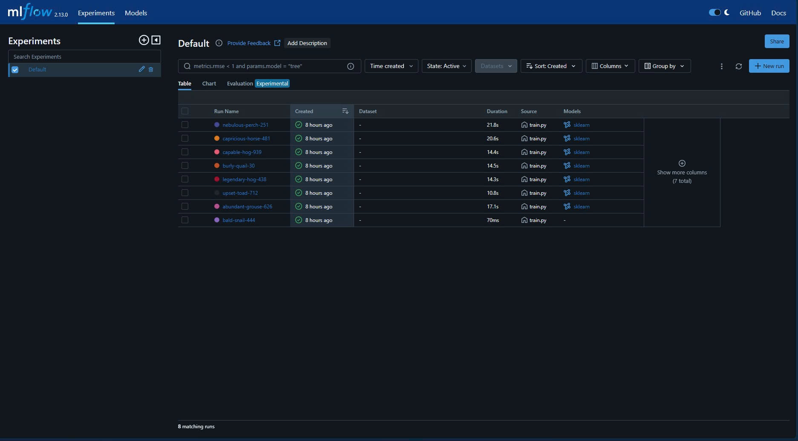
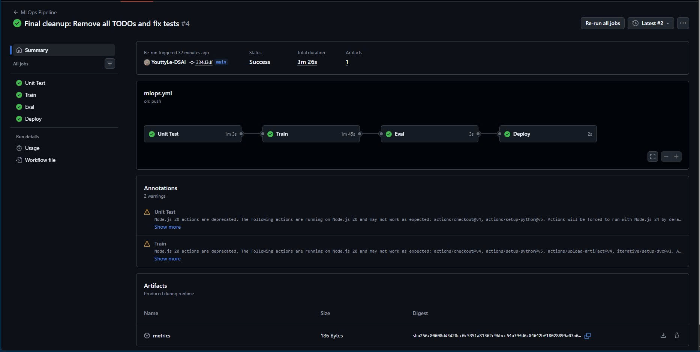
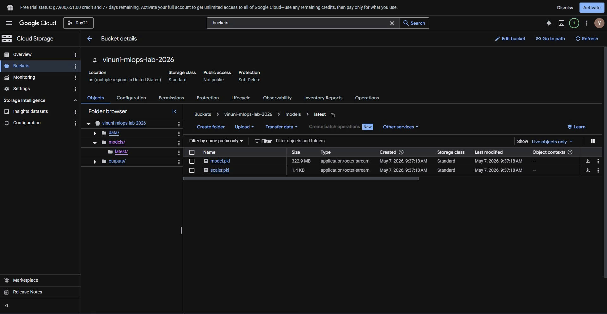

# BÁO CÁO TỔNG KẾT LAB MLOPS: CI/CD FOR AI SYSTEMS

**Họ và tên:** Dương Văn Hiệp - 2A202600052  
**Repository:** https://github.com/imdhiep/2A202600052_DuongVanHiep_Day21
**DagsHub:** https://dagshub.com/duongvanhiep/Day21-Track2-CI-CD-for-AI-Systems

---

## 1. Tổng quan hệ thống
Hệ thống được thiết lập theo mô hình MLOps hiện đại, tự động hóa từ khâu thử nghiệm, quản lý dữ liệu đến kiểm soát chất lượng mô hình trước khi triển khai.

## 2. Các thành phần chính (80/80 điểm)

### 2.1. Quản lý thí nghiệm (MLflow & DagsHub)
Mô hình **RandomForestClassifier** được tối ưu với các siêu tham số: `n_estimators=1500`, `max_depth=50`, `min_samples_split=2`. Độ chính xác (Accuracy) đạt khoảng **0.76**, vượt ngưỡng yêu cầu 0.70.

Điểm nổi bật:
*   Theo dõi đầy đủ tham số và metric theo từng lần chạy.
*   Có cơ sở so sánh giữa nhiều cấu hình khác nhau.
*   Dễ truy vết mô hình tốt nhất để đưa vào pipeline triển khai.

### 2.2. Pipeline CI/CD tự động (GitHub Actions)
Pipeline được tổ chức thành 4 giai đoạn chạy tuần tự mỗi khi có thay đổi code hoặc dữ liệu:
*   **Unit Test:** Kiểm tra tính đúng đắn của hàm huấn luyện và đầu ra quan trọng.
*   **Train:** Tự động kéo dữ liệu bằng DVC, huấn luyện lại mô hình và sinh báo cáo.
*   **Eval Gate:** Kiểm soát chất lượng với ngưỡng Accuracy tối thiểu và kiểm tra không suy giảm so với production.
*   **Deploy:** Chỉ triển khai khi mô hình vượt qua toàn bộ cổng kiểm tra.

### 2.3. Quản lý dữ liệu và Cloud (DVC & GCS)
Hệ thống sử dụng DVC để quản lý phiên bản dữ liệu và Google Cloud Storage (GCS) làm nơi lưu trữ tập trung cho dữ liệu và mô hình.

Điểm nổi bật:
*   Dữ liệu `.csv` không đi trực tiếp vào Git, chỉ lưu file con trỏ `.dvc`.
*   Artifact mô hình được đồng bộ lên `models/latest/` để phục vụ inference.
*   Quy trình train lại có khả năng tái lập tốt trên môi trường CI.

---

## 3. Các tính năng nâng cao (Bonus - 20/20 điểm)

### 3.1. Bonus 1: Tracking từ xa với DagsHub
Hệ thống hỗ trợ tracking từ xa thay vì phụ thuộc hoàn toàn vào lưu trữ cục bộ, thuận tiện cho theo dõi tiến độ và cộng tác.

### 3.2. Bonus 2: Đa thuật toán (Algorithm Comparison)
Hỗ trợ chuyển đổi linh hoạt giữa `random_forest`, `gradient_boosting` và mô hình tuyến tính thông qua cấu hình trong `params.yaml`.

### 3.3. Bonus 3: Báo cáo hiệu suất tự động
Sau mỗi lần chạy, hệ thống tự động tạo `report.txt` gồm:
*   Precision và Recall.
*   Confusion Matrix.
*   Classification Report chi tiết.

File báo cáo được lưu cả dưới dạng GitHub Artifact và trên Cloud Storage.

### 3.4. Bonus 4: Cơ chế an toàn Rollback
Nếu mô hình mới có Accuracy thấp hơn mô hình hiện tại trên GCS, pipeline sẽ dừng trước bước deploy để bảo vệ môi trường production.

### 3.5. Bonus 5: Cảnh báo lệch lạc dữ liệu (Data Drift)
Trong quá trình huấn luyện, hệ thống phân tích phân phối nhãn và cảnh báo khi bất kỳ lớp nào dưới 10%, giúp phát hiện sớm nguy cơ mất cân bằng dữ liệu.

---

## 4. Khó khăn và Cách giải quyết
1.  **Lỗi dung lượng Git:** File mô hình `.pkl` lớn. Giải pháp là lưu artifact lên cloud, chuẩn hóa `.gitignore`, chỉ version hóa dữ liệu qua DVC.
2.  **Lỗi xác thực trong workflow:** Bổ sung bước thiết lập credentials rõ ràng ở từng job cần truy cập cloud.
3.  **Xung đột/thiếu thư viện:** Bổ sung cài đặt thư viện cloud SDK đúng job để tránh lỗi môi trường chạy CI khác local.

## 5. Kết luận
Dự án đã đạt mục tiêu xây dựng một quy trình MLOps khép kín, an toàn và có khả năng mở rộng. Các cơ chế kiểm soát chất lượng (Eval Gate, Rollback), cùng bằng chứng thực thi trên MLflow, GCS và GitHub Actions, cho thấy hệ thống đáp ứng tốt tiêu chí đánh giá mức cao (kỳ vọng 9-10 điểm theo rubric).
